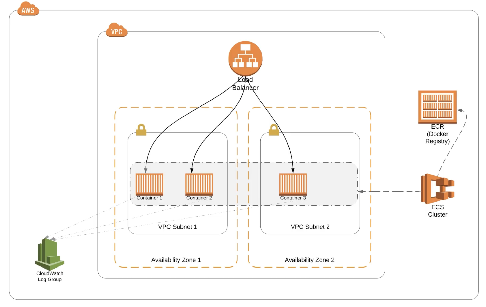

# Deploying Spring Boot application on Amazon ECS/AWS Fargate with Application Load Balancer

This sample project deploys a Java 21 Spring Boot application on Amazon ECS using AWS Fargate with Application Load Balancer to route traffic between two ECS Tasks.

## Requirements

- [Create an AWS account](https://portal.aws.amazon.com/gp/aws/developer/registration/index.html) if you do not already have one and log in. The IAM user that you use must have sufficient permissions to make necessary AWS service calls and manage AWS resources.
- [AWS CLI](https://docs.aws.amazon.com/cli/latest/userguide/install-cliv2.html) installed and configured
- [Git Installed](https://git-scm.com/book/en/v2/Getting-Started-Installing-Git)
- [AWS Serverless Application Model](https://docs.aws.amazon.com/serverless-application-model/latest/developerguide/serverless-sam-cli-install.html) (AWS SAM) installed
- [Java 21 or above](https://docs.aws.amazon.com/corretto/latest/corretto-17-ug/downloads-list.html) installed
- [Maven 3.8.6 or above](https://maven.apache.org/download.cgi) installed
- [Docker](https://docs.docker.com/engine/install/) installed
- [jq](https://jqlang.github.io/jq/download/) installed


## Deployment Instructions

1. From the command line, execute the below command to build the project.
   ```bash
      mvn clean package
   ```

2. (Optional) Run the application on local box using the below command:
   ```bash
      mvn spring-boot:run
   ```

3. Please *ensure* that docker is up and running before executing this step. From the command line, run the below command 
   - to create ECR repository, build [the docker image](infra/Dockerfile) and push it into the ECR repository.

   - and also to create common cloudformation stacks: 
     - vpc ([vcp.yml](infra/vcp.yml)) 
     - iam ([iam.yml](infra/iam.yml))
     - ecs cluster ([cluster.yml](infra/cluster.yml))

   ```bash
      bash build.sh
   ```
   if you get this error: 
   ``` 
    ERROR: Multi-platform build is not supported for the docker driver.
    Switch to a different driver, or turn on the containerd image store, and try again.
    Learn more at https://docs.docker.com/go/build-multi-platform/
   ```

   please run first: 
   ```bash
    docker buildx create --name multiarch --driver docker-container --use
   ```

4. Run the below command to deploy the AWS resources for the pattern as specified in the template.yml file:
   ```bash
      sam deploy --guided
   ```
or just...
   ```bash
      ./deploy.sh
   ```

5. During the prompts:

   - Enter a stack name
   - Enter the same as AWS Region that you provided while building the image. 
   - `ImageURI` Enter the image URI obtained from the previous output (from build.sh).
   - Allow SAM CLI to create IAM roles with the required permissions.
   - Keep default values to the rest of the parameters.

   If you have run `sam deploy --guided` mode once and saved arguments to a configuration file (samconfig.toml), you can use `sam deploy` in future to use these defaults.

5. Note the outputs from the SAM deployment process. These contain the resource names and/or ARNs which are used for next step as well as testing.

## How it works

This sample project deploys a Java 21 Spring Boot application on Amazon ECS Fargate with Application Load Balancer to route traffic between two ECS Tasks. The application exposed REST APIs which can be accessed over HTTP.

Please refer to the architecture diagram below:



Here's a breakdown of the steps:

1. **Amazon Elastic Container Registry**: The repository of the container image of the Spring Boot Application.

2. **Application Load Balancer**: Receives the HTTP request which routes the traffic to one of the Amazon ECS Tasks.

3. **Amazon Elastic Container Service**: Amazon ECS Cluster is configured with one service having 2 Tasks. The 2 Tasks runs the Spring Boot application as container. The container image is retrieved from the Amazon Elastic Container Registry. 
